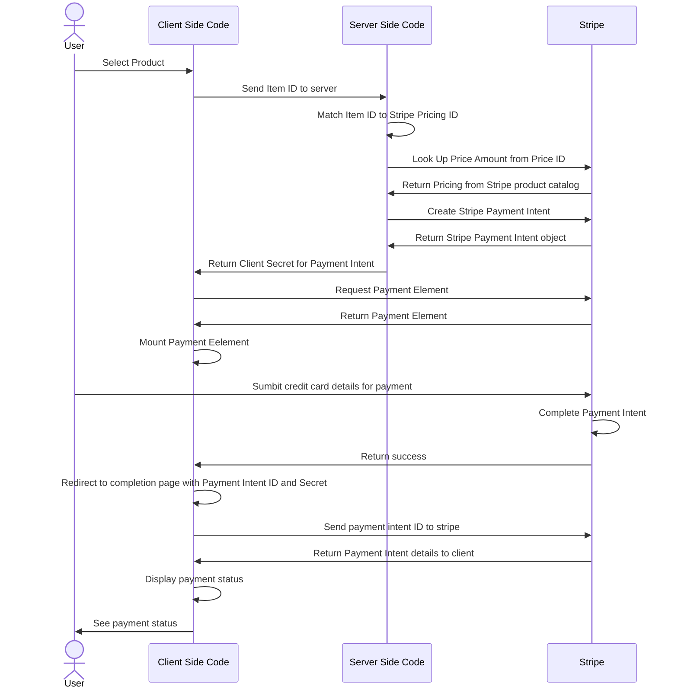

# Evan's Stripe SA Assignment
This is Evan's submission for the take home SA Assignment for Stripe.

## How to build, configure and run
- Open your terminal of choice
- Clone this repo locally
  ```
  git clone https://github.com/EvanPalmer/sa-takehome-project-node-submit.git
  ```
- Set keys in config file
  - in folder where the repository has been cloned
  - rename sample.env to .env
  - open .env in your editor of choice and update your API keys found here: https://dashboard.stripe.com/test/apikeys
- Add products in dashboard
  - Navigate to your product dashboard: [https://dashboard.stripe.com/test/products?active=true](https://dashboard.stripe.com/test/products?active=true)
  - Click "Create product"
  - Enter
    - Name: Price for Working in Public: The Making and Maintenance of Open Source
    - Image: public/images/working-in-public.jpg
  - Click "Add product"
  - Click "One Time Price"
    - Amount: 28
    - Click **Next**
  - Click **Add product**
  - Click "Create product"
  - Enter
    - Name: The Making of Prince of Persia: Journals 1985-1993
    - Image: public/images/prince-of-persia.jpg
  - Click "Add product"
  - Click "One Time Price"
    - Amount: 25
    - Click **Next**
  - Click **Add product**
  - Click "Create product"
  - Enter
    - Name: The Art of Doing Science and Engineering
    - Image: public/images/art-science-eng.jpg
  - Click "Add product"
  - Click "One Time Price"
    - Amount: 23
    - Click **Next**
  - Click **Add product**
- Add corresponding products into source code
  - For each of the products created we need to add the PriceID to the code.
  - Navigate to your Product Catalog  [https://dashboard.stripe.com/test/products?active=true](https://dashboard.stripe.com/test/products?active=true)
  - Select a Product
  - Click the ellipsis ('...') next to the price created above
  - Click "Copy Price ID"
  - Open the **app.js** file in your IDE of choice
  - Update the associated price on lines 65, 70 and 75
    
- Confirm port and localhost
  - Open the **app.js** file in your IDE of choice
  - Confirm the YOUR_DOMAIN constant on line 6
- Run the app
  - In your terminal of choice, navigate to the folder you cloned this repo to
  - Install dependencies, and run web application
     ```
     npm install
     npm start
     ```
- Run in browser
  - Open Browser
  - Navigate to **http://localhost:3000/**
- Purchase a product
  - In the browser, select a product by clicking the blue "Purchase" button
  - Enter the Stripe Test card number 4242 4242 4242 4242
  - Enter any future date for the expiration data
  - Enter any three digits for the CVC
  - Click **pay now*


## The Solution
### How it works

### Which APIs
- stripe.paymentIntents
  - _create_ a payment intent when we load up the payment on the server side
- stripe.retrievePaymentIntent
 - retrieve the payment intent on the client side
- stripe.prices.retrieve
  - to retrieve prices on the server side ensuring the payment is made in alignment with the catalog.
- stripe.elements
 - to create the payment component on the client side
 - I should have worked on the look and feel here
- stripe.checkout.sessions.create
  - I used this to create a session on the server side when using the Embedded Form technique
- stripe.checkout.sessions.retrieve
  - I used this to get the checkout session on the server side when using the Embedded Form technique

### How is it architected
The application follows the example at https://docs.stripe.com/payments/quickstart with the addition of price look up against the Stripe Product Catalog.

The flow as a sequence diagram below.


## My Approach
### How did you approach this problem? 
1. Read requirements in email from Izzy
 - Selected Node because of the languages supported I'm most familiar with JavaScript
 - I considered building with .Net and C#
 - Noted that I'll need to keep track of a few things, like my approach and considerations for production, so started taking notes as I went along.

2. Read GitHub Instructions
 - Noting I'll need to familiarise myself with Express Framework and the Stripe SDK

3. I forked, cloned and installed from the Stripe git repo

4. Open in VS Code
 - Update keys from my dashboard
 - Installed **nodemon** and **dotenv**
 - Have a glance at the source code structure, which looks straight forward with app.js and some views.
		
5. Run application
 - I just wanted to get an understanding of the base state I'm working with
 - The site is super clear regarding what needs to be done

6. Review Stripe install docs
 - Discovered and installed Stripe for Visual Studio Code
 - Installed CLI
 - This was really because I was interested in the developer tooling, and was impressed by the quality I found!
 - Noted that there are several ways to implement this. I'll try a few, but suspect I'll land on Embedded form. 
	- Low code
  	- Stripe Hosted Page
	- Embedded Form
	- Advanced integration
 - Decided to start with the most basic method and iterate, so I built it with Low Code, which was trivial. Then the Stripe Hosted-Page which was very straight forward. Then used the Embedded Form, and lastly I used Stripe Elements. 
 - ** According to the instructions there is a requirement to build this using <ins>Stipe Elements</ins>. I didn't realise ths was a proper noun otherwise I would probably have prioritised! So started looking into each different way to build this with Stripe.
 - To see my other builds, please see the repo here, noting both branches.
   ```
   https://github.com/EvanPalmer/sa-takehome-project-node-initial
   ```

   

7. Review Express Framework
 - Super simple, but I just quickly checked in on the basics as it was relatively new to me.

8. Review Dashboard, in particular Product Catalog, Pricing Transactions and I found the logs useful too. 

### Which docs did you use to complete the project? 
Final build is based off the Advanced integration quickstart guide here:
https://docs.stripe.com/payments/quickstart

Additionally I used many other documents including:
1. Low Code: https://docs.stripe.com/no-code
2. Stripe Hosted: https://docs.stripe.com/checkout/quickstart
3. Embedded Form: https://docs.stripe.com/checkout/embedded/quickstart
4. Stripe Elements: https://docs.stripe.com/payments/payment-element
5. Payment Intents: https://docs.stripe.com/payments/payment-intents


### What challenges did you encounter?
- Major challenge was having a newborn baby in the middle of my prep! But that was a good challenge and not unexpected :)
- I've written production JavaScript in my life as a developer, so comfortable with the syntax, but I've never professionally built backend Node applications, so there was a slight learning curve.
  - For example, I wasn't sure of the best way to associate the client side code with a Handlebars template or route. I'm still not sure I followed best practice here.
- I built a lot without realising that the requirements specify to use the Stripe Elements technique. When I realised I needed to build with Stripe Elements, I had to take a step back and understand the payment intent API as I didn't use that for other builds. And in hindsight, it was good to slowly move up in complexity of builds as a learning exercise, but it was probably a bit too time consuming meaning I couldn't do a lot of the additional work I had planned that would have looked quite cool (see TODOs below). 

## Productionize and TODO
_How you might extend this if you were building a more robust instance of the same application._

My build is clearly not production ready. I'll break this up into two sections: Productionize and TODO.

1. Productionize
_This is work that would be required or highly recommended for a real build, but I wouldn't set this up for the assignment._

- Need a proper deploy pipeline, and automation across environments
- ERP/Caltalog integration
- Unit and functional test coverage
- Production banking etc details in Stripe dashboard
- SSL

2. TODO
_This is work that I would like to do if I had a little more time._

- Better responses page for completion
 - I basically used it as-is from the example code. I know it looks ugly, I actually think it's not honoring the CSS styles/components properly.
- Proper environment variable control in the client side, at least encapsulated in some way, rather than just scattered around as magic strings
- Better appearance of the payment component
 - I used the basic element, and didn't really play around with customised appearance and other options that look interesting.
- Better error handling eg: on the query string, server connections etc. 
- Client side code is a bit naff in general. I mentioned earlier that I'm not sure I followed best practice, so I'd probably ask for a peer review from someone with more experience here.
- Customise look and feel
- I wanted to create a build script that populated the products and prices in Stripe and also was used in the application, for ease of set up.
